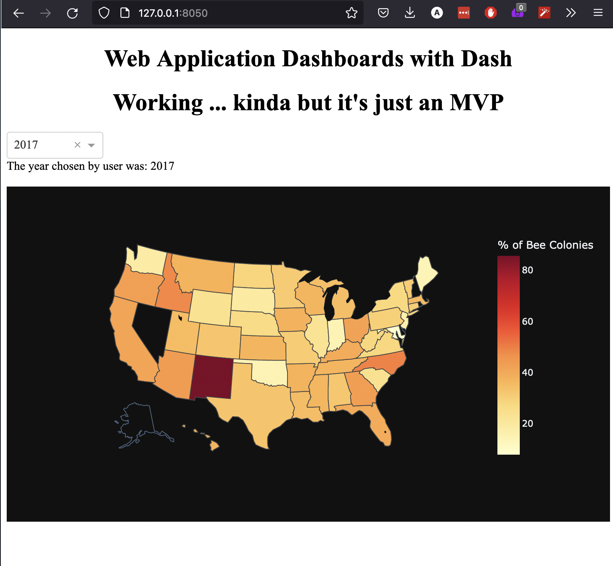

# Bees

This is a MVP for a Dash choropleth with a dropdown.

## How to run it:
 

In the `src` folder type `python bees.py`
copy the url to your browser

You'll need to have dash and pandas installed

 

## What it will look like:

